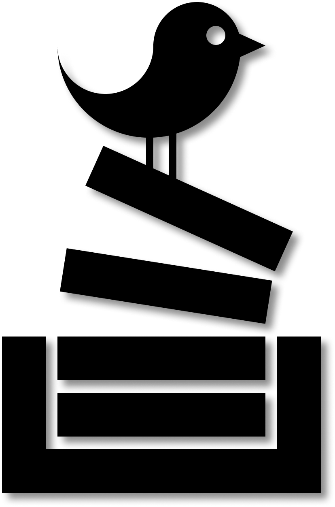
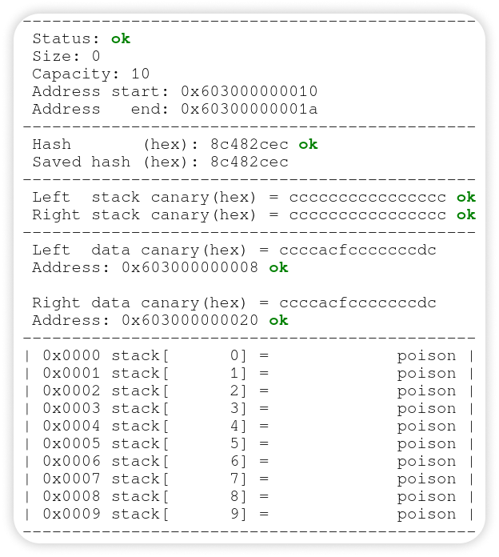

     

# Stack
Simple secure stack data structure implementation. It was written by a MIPT student as homework task.
* [Installation](#installation)
* [Usage](#usage)
* [Docs](#docs)

## Installation
You should have `git`, `make` and `g++ compiler` installed.
* Clone this repository:
    * `git clone https://github.com/d3phys/Stack.git`
 * Build the program:
    * `cd Stack/`
    * `make bin`

## Usage
Stack uses two secure techniques - `canary protection` and `hash protection`:

* To use `canary protection` define `#define CANARY_PROTECT`.
* To use `hash protection` define `#define HASH_PROTECT`. Hash is an expensive protection.

If you want to disable protection define `#define UNPROTECT`. 
Stack protection will be disabled regardless of whether canary or hash protection were previously defined.

Also this stack provides a smart log system. You can open `Stack/log.html`.

     

## Docs
If you want to use some modules or modify the whole program, you can check the documetation.
Check `<local_path_to_repo>/docs/compiled`
